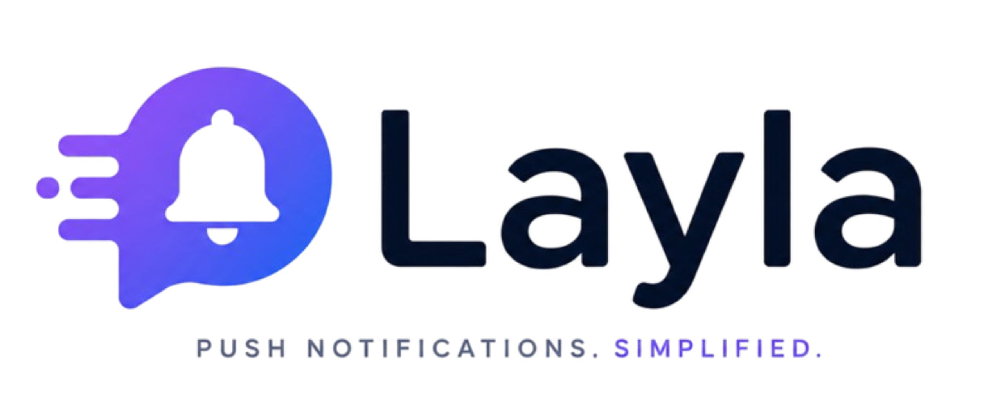

<p align="center">
      
    </p>

# <p align="center">Layla</p>

Web push notifications, without the bloat.

Drop one line of JS on your site and start sending browser push notifications. No email, no trackers, no cookies. A 16-digit code is your entire account.


<p align="center">
    
</p>

## What it does

- **Sign up with a code.** No email, no password. Layla generates a 16-digit code — that's your account. Lose it, lose the account. There is no recovery.
- **Add a site.** Register an origin (HTTPS only). You get a snippet.
- **Paste the snippet.** One `<script>` tag. Layla registers the service worker, prompts users for push permission, and stores the subscription.
- **Send notifications.** From the dashboard: title, message, optional URL and icon. Delivered via FCM / Mozilla autopush / APNs.

## Stack

- Next.js 14 (App Router)
- MongoDB
- `web-push` (VAPID)
- Cloudflare Turnstile (bot protection on auth)
- Tailwind + Framer Motion

## Running locally

```bash
npm install
cp .env.local.example .env.local   # fill in the values below
npm run dev
```

### Environment

```
MONGODB_URI=...
MONGODB_DB=Layla

SESSION_SECRET=<32+ random bytes, hex>
CODE_PEPPER=<any secret string>

VAPID_PUBLIC_KEY=...
VAPID_PRIVATE_KEY=...
VAPID_CONTACT=mailto:you@example.com

NEXT_PUBLIC_APP_URL=https://your-domain

CF_TURNSTILE_SITE_KEY=...
CF_TURNSTILE_SECRET_KEY=...
NEXT_PUBLIC_TURNSTILE_SITE_KEY=...
```

Generate VAPID keys with `npx web-push generate-vapid-keys`.

### MongoDB indexes

Run these once against your database:

```js
db.users.createIndex({ codeHash: 1 }, { unique: true })
db.sites.createIndex({ siteId: 1 }, { unique: true })
db.sites.createIndex({ userId: 1 })
db.subscribers.createIndex({ siteId: 1, endpoint: 1 }, { unique: true })
db.notifications.createIndex({ siteId: 1, sentAt: -1 })
db.login_attempts.createIndex({ at: 1 }, { expireAfterSeconds: 900 })
```

## Deploying

Works on Vercel out of the box. Set all env vars in the project settings, add your domain to the Cloudflare Turnstile allowlist, and go.

## Privacy

- Only the salted hash of your code is stored — never the plaintext.
- No analytics, fingerprinting, or third-party requests in the embed script.
- Only cookie is your session.
- Push subscription endpoints are opaque tokens routed to browser vendors — Layla cannot identify subscribers from them.

Full details on [/tos](https://layla.wtf/tos). Common questions on [/faq](https://layla.wtf/faq).

## License

MIT.
